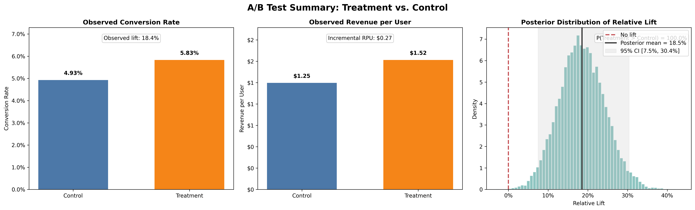
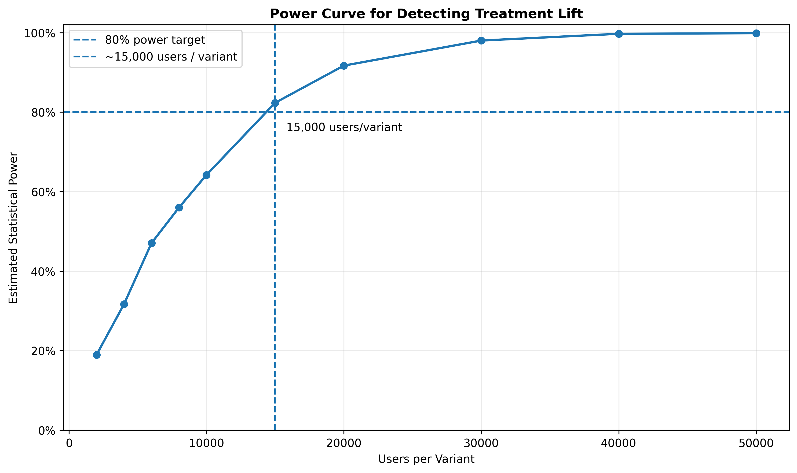

# Expected Value in Practice: Monte Carlo Simulation for Real A/B Testing & Experimentation Decisions

**Self-Directed Study Note + Reproducible Project**  
*Part 2 of the Decision Theory Series (while completing the MITx MicroMasters)*

This project evolves Part 1 (EV vs. mode) into a production-grade A/B testing decision engine.

### Key Features
- User-level simulation (conversion + lognormal revenue)
- Bayesian Expected Value with Beta-Binomial posteriors
- Monte Carlo power analysis
- VaR / CVaR risk metrics
- Interactive Streamlit dashboard (bonus)

### Results (15,000 users/variant, true lift = 15%)
- Posterior EV lift: **18.5%**
- P(Treatment > Control): **100.0%**
- Expected incremental revenue: **\$4,050**
- 5% VaR: **-\$1,120**

**Visuals:**

### How It Ties to the Master Plan
- Deepens **Box A (Probability)**: EV, Bayesian updating, simulation
- Bridges directly into experimentation judgment (ship/kill/extend decisions)
- Follows the exact “study note + flagship project” cadence

**GitHub:** [expected-value-in-ab-testing](https://github.com/viniciusmiozzo/expected-value-in-ab-testing)

**Previous:** [Part 1 – EV vs. Most Likely Outcome](../expected-value-vs-most-likely)

Last updated: March 2026
