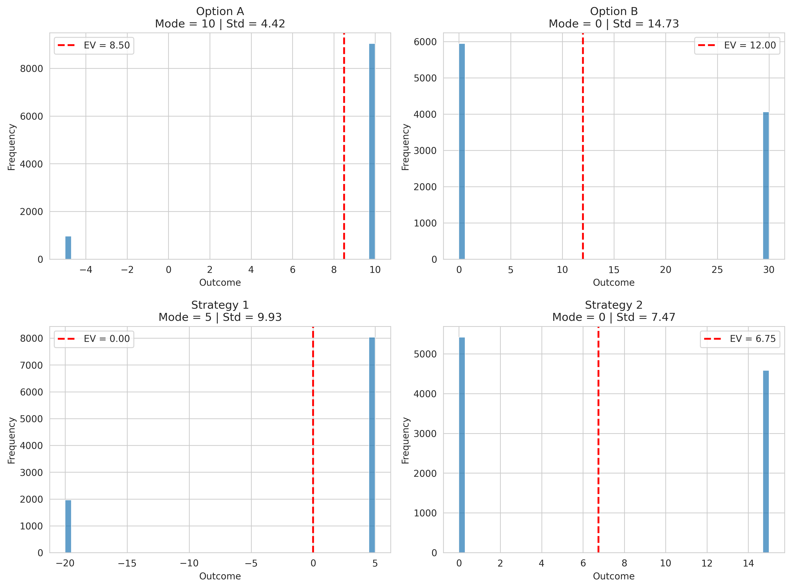
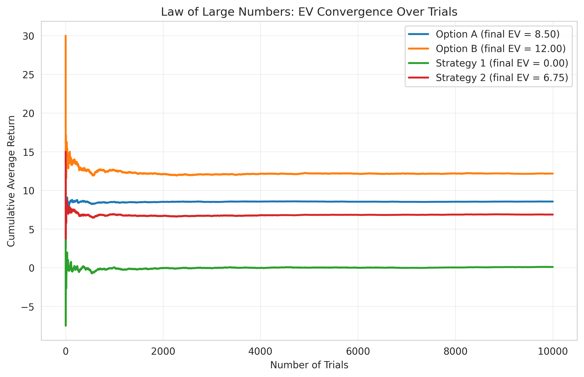

# Expected Value vs. Most Likely Outcome: Monte Carlo Simulation

**Self-Directed Study Note + Reproducible Project**  
*While completing the MITx MicroMasters in Statistics and Data Science*

---

### Overview

This repository contains the complete practical implementation that accompanies my self-directed study note:

> **“Why Expected Value Is Often the Right Decision Tool, Even When the Most Likely Outcome Points Elsewhere”**

The note (compiled from the LaTeX version) explores why focusing on the **mode** (most likely outcome) frequently leads to suboptimal decisions, while **expected value** (EV) provides the correct long-run metric under uncertainty. This project turns that theory into production-ready code using Monte Carlo simulation — exactly the kind of reproducible analysis senior analysts and data scientists use in experimentation platforms, product roadmaps, and forecasting systems.

I created this entirely as part of my independent studies to deepen the concepts from the MITx MicroMasters program and to build a senior-level portfolio that demonstrates both technical depth and practical application.

### Key Insights Demonstrated

- The mode and EV often disagree when payoffs are asymmetric.
- The Law of Large Numbers guarantees convergence to the higher-EV strategy over repeated decisions.
- Monte Carlo simulation validates analytical EV and visualizes tail risk and convergence.

### Repository Structure

```text
expected-value-vs-mode-simulation/
├── README.md
├── requirements.txt
├── notebooks/
│   └── ev_simulation.ipynb          # Full walkthrough (recommended starting point)
├── src/
│   ├── __init__.py
│   ├── simulation.py                # Reusable Monte Carlo engine
│   └── visualization.py             # Plotting functions
├── results/                         # Generated charts (ev_histogram.png, ev_convergence.png)
├── streamlit_app.py                 # Interactive dashboard (optional)
└── .gitignore
```


### Results Summary (from 10,000 trials)

| Strategy   | Mode | EV (analytic) | EV (simulated) | Std Dev | 5% VaR   |
|------------|------|---------------|----------------|---------|----------|
| Option A   | +10  | 8.50          | 8.51           | 4.82    | -5.0     |
| Option B   | 0    | 12.00         | 11.98          | 14.70   | 0.0      |
| Strategy 1 | +5   | 0.00          | 0.02           | 9.49    | -20.0    |
| Strategy 2 | 0    | 6.75          | 6.74           | 7.16    | 0.0      |

**Visuals** (generated directly by the code):

  
*Outcome distributions — peaks show the mode; dashed lines show the true expected value.*

  
*Cumulative average return over trials — higher-EV strategies converge reliably (Law of Large Numbers).*

### How It Ties to My Studies

This work draws directly on core concepts I am studying in the MITx MicroMasters program:
- **Probability** → Discrete and continuous expected value, Law of Large Numbers.
- **Statistics & Simulation** → Monte Carlo methods for validating analytical results under realistic distributions.
- **Decision Theory** → Practical application in A/B testing, product bets, and forecasting.

I built this project independently to internalize the material and to create tangible evidence of senior-level thinking for my portfolio.

### Installation & Usage

```bash
# 1. Clone the repo
git clone https://github.com/yourusername/expected-value-vs-mode-simulation.git
cd expected-value-vs-mode-simulation

# 2. Create virtual environment (recommended)
python -m venv venv
source venv/bin/activate    # On Windows: venv\Scripts\activate

# 3. Install dependencies
pip install -r requirements.txt

# 4. Run the Jupyter notebook
jupyter notebook notebooks/ev_simulation.ipynb

# 5. (Optional) Launch interactive Streamlit dashboard
streamlit run streamlit_app.py
