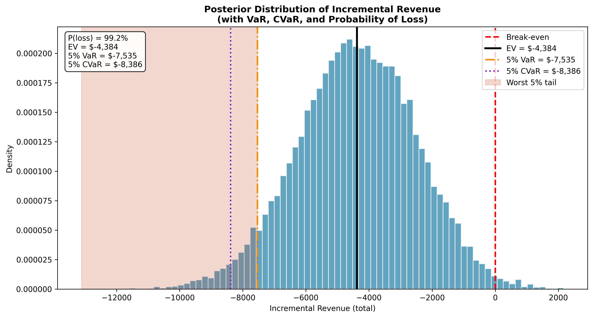

# Risk-Adjusted Decision Making: When Expected Value Is Not Enough

**Self-Directed Study Note + Reproducible Project**  
*Part 3 of the Decision Theory Series (while completing the MITx MicroMasters in Statistics and Data Science)*

This project extends Parts 1 and 2 by introducing tail risk, CVaR, and survivability considerations in high-stakes, one-shot product decisions.

### Key Insights Demonstrated
- Even when the true lift is positive (15 %), a small probability of catastrophic downside can make the overall decision unattractive.
- Expected Value alone can be misleading in one-shot scenarios.
- CVaR and probability of ruin provide a more complete risk picture than EV.
- Repeatable small tests vs. one-shot high-stakes launches require different decision rules.

### Results (One-Shot High-Stakes Scenario)
- Posterior EV revenue gain: **-$4,384**
- 5% VaR: **-$7,535**
- 5% CVaR: **-$8,386**
- Probability of ruin (negative revenue): **99.2%**

**Visual:**
  
*Posterior distribution of incremental revenue showing EV, VaR, CVaR, and the worst 5% tail.*

### How It Ties to the Master Plan
- Deepens **Box A (Probability)**: extends EV with coherent risk measures and tail risk modeling.
- Bridges into senior experimentation judgment: shows when to move beyond simple EV in high-stakes decisions.
- Follows the exact “study note + flagship project + public writing” cadence described in the plan.

### Repository Structure

``` text
risk-adjusted-decision-making/
├── README.md
├── requirements.txt
├── notebooks/
│   └── risk_adjusted_decision.ipynb
├── src/
│   ├── simulation.py
│   └── visualization.py
├── results/
│   └── risk_posterior.png
├── generate_results.py
└── .gitignore
```


### Installation & Usage
```bash
git clone https://github.com/VinnieMiozzo/analytical-journal-lab.git
cd analytical-journal-lab/essays/risk-adjusted-decision-making

python -m venv venv
source venv/bin/activate    # On Windows: venv\Scripts\activate

pip install -r requirements.txt

# Generate results and figures
python generate_results.py

# Open the notebook
jupyter notebook notebooks/risk_adjusted_decision.ipynb
